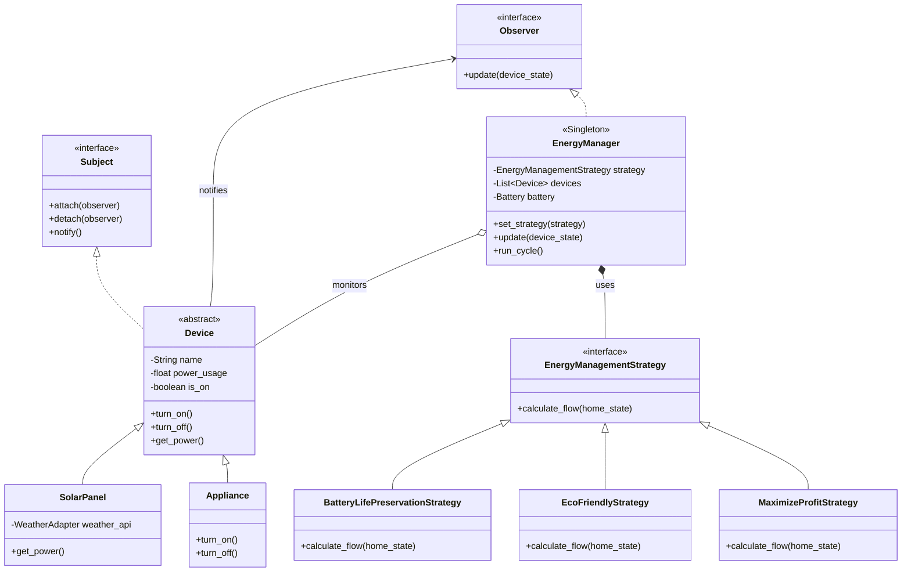

# Software Design Document (SDD): Smart Home Energy Management System (EMS)

## Cel projektu
Stworzenie inteligentnego systemu nadzorującego przepływ prądu w gospodarstwie domowym w celu minimalizacji kosztów energii, optymalizacji zużycia oraz maksymalizacji wykorzystania odnawialnych źródeł energii (OZE), takich jak panele fotowoltaiczne. System ma wspierać różne strategie zarządzania energią i dynamicznie reagować na warunki pogodowe oraz ceny prądu.

## Technologie
*   **Frontend**: React + TypeScript
*   **Backend**: FastAPI (Python)
*   **Baza danych**: PostgreSQL
*   **ORM**: SQLAlchemy 2.0 (asyncpg) + Alembic
*   **Infrastruktura**: Docker (baza danych + aplikacja)

---

## Ustalenia po konsultacji z Użytkownikiem
1. **Urządzenia**: System będzie symulował i odczytywał stan urządzeń (ich zużycie), ale nie będzie fizycznie nimi sterował (wyłączał/włączał).
2. **Pogoda API**: Wykorzystane zostanie darmowe API bez konieczności rejestracji – **Open-Meteo**.
3. **Ceny Prądu**: Na ten moment zrezygnowano z API dostawców. Przyjęto konfigurowalne przez użytkownika (lub stałe w kodzie) ceny kupna i sprzedaży energii.
4. **Baza Danych**: Historia zużycia, zysków i strat będzie trwale zapisywana w bazie (PostgreSQL) dla celów statystycznych.

---

## Architektura Systemu i Komponenty

Proponowany podział systemu:

### 1. Moduł Integracji Zewnętrznych
*   **Weather Service**: Komunikacja z API pogodowym (Open-Meteo), pobieranie poziomu nasłonecznienia, co wpływa na estymację produkcji z paneli fotowoltaicznych.
*   **Pricing Service**: Zarządzanie stałymi / konfigurowalnymi przez użytkownika stawkami za energię (zamiast zewnętrznego API).

### 2. Moduł Domu (Home Environment)
*   **Zarządca Baterii (Storage)**: Monitorowanie SoC (State of Charge - stan naładowania), zarządzanie ładowaniem/rozładowywaniem w zależności od strategii.
*   **Urządzenia (Appliances)**: Reprezentacja poszczególnych sprzętów z ich aktualnym poborem mocy.
*   **Zasilanie Zewnętrzne (Solar Panels)**: Estymacja produkcji na podstawie danych z Weather Service.

### 3. Silnik Zarządzania (Energy Manager)
Rdzeń aplikacji (Core). Zbiera dane ze wszystkich komponentów i na podstawie wybranej *Strategii* decyduje:
*   Czy pobierać prąd z sieci, z paneli, czy z baterii?
*   Czy nadwyżkę prądu ładować do baterii, czy sprzedawać do sieci?

---

## Proponowane Wzorce Projektowe (OOP)

Z racji tego, że jest to projekt na zaliczenie z Programowania Obiektowego (PO), system zostanie oparty na następujących, silnie akcentowanych wzorcach:

### 1. Wzorzec Strategii (Strategy)
**Zastosowanie**: Oczywisty wybór dla Twoich 3 trybów zarządzania energią.
Pozwoli na enkapsulację algorytmów zarządzania energią w osobnych klasach o wspólnym interfejsie.
*   `EnergyManagementStrategy` (Interfejs/Klasa Bazowa)
    *   `MaximizeProfitStrategy` (Sprzedaje drogą energię, kupuje tanią)
    *   `EcoFriendlyStrategy` (Ogranicza pobór z sieci węglowej, dąży do 100% OZE)
    *   `BatteryLifePreservationStrategy` (Blokuje rozładowanie baterii poniżej 20%)

### 2. Wzorzec Obserwatora (Observer)
**Zastosowanie**: Gdy zmienia się stan któregoś z urządzeń (np. pralka włącza się i zaczyna pobierać 2kW prądu) lub gdy drastycznie zmienia się pogoda/cena, odpowiednie komponenty (jak EnergyManager) muszą natychmiast o tym wiedzieć, aby przeliczyć bilans.
*   Urządzenia i Sensory to tzw. *Wydawcy (Publishers)*, a `EnergyManager` to *Subskrybent (Observer)*.

### 3. Metoda Wytwórcza (Factory Method)
**Zastosowanie**: Tworzenie instancji urządzeń domowych oraz integracji API.
Zamiast tworzyć obiekty ręcznie używając słowa kluczowego (lub konstruktora w Pythonie), użyjemy fabryk:
*   `ApplianceFactory` - np. `create_appliance("fridge")`, `create_appliance("oven")`. Różne sprzęty mogą mieć różną charakterystykę poboru.
*   `ApiClientFactory` - tworzenie odpowiednich klientów HTTP (np. z symulowanymi danymi do testów lub z rzeczywistym API do produkcji).

### 4. Wzorzec Adaptera (Adapter)
**Zastosowanie**: Integracja z zewnętrznymi API (Pogoda, Ceny Prądu).
Różni dostawcy mogą mieć różny format zwracanych danych (np. JSON, XML). Zbudujemy `WeatherAdapter`, który pobierze dane z zewnętrznego systemu i przetłumaczy je na jednolity interfejs obiektowy (np. obiekt `WeatherCondition`), zrozumiały dla naszego systemu EMS.

### 5. Singleton (Wzorzec Singleton)
**Zastosowanie**: Główny koordynator systemu (`EnergyManager` / `SystemState`) oraz obiekt `DatabaseConnection`. W domu mamy tylko jedno główne "serce" zarządzania zasilaniem, nie chcemy by różne części kodu tworzyły kilka takich instancji.

### Diagram Klas (UML)
Poniższy diagram prezentuje strukturę najważniejszych klas i zastosowanych wzorców (wzorzec Strategii, Obserwator, Adapter):

---

## Modele Danych (SQLAlchemy)

Poniżej wstępny zarys głównych tabel/klas w bazie:

#### [NEW] `models/device.py`
Zawiera modele opisujące urządzenia.
*   `Device`: ID, nazwa (np. lodówka), typ (odbiornik, panel, bateria), max_zużycie, status (on/off).

#### [NEW] `models/battery.py`
Zawiera informacje o magazynie energii.
*   `Battery`: pojemność całkowita, obecny poziom naładowania (kWh), minimalny próg bezpieczeństwa.

#### [NEW] `models/settings.py`
Konfiguracja systemu przypisana do użytkownika.
*   `SystemSettings`: aktywny tryb (strategia), lokalizacja (dla API pogodowego).

#### [NEW] `models/energy_log.py`
Gromadzenie statystyk do wyświetlania na wykresach na Frontendzie.
*   `EnergyLog`: timestamp, zużyto_kWh, wyprodukowano_kWh, koszt, zysk_ze_sprzedaży.

---

## Propozycja Planu Weryfikacji i Realizacji
1. **Faza 1 (Setup)**: Inicjalizacja FastAPI, React, stworzenie bazy w Dockerze, spięcie z Alembic.
2. **Faza 2 (Core & OOP)**: Implementacja klas modelu dziedziny, wzorców projektowych (Strategie, Obserwatory) w czystym Pythonie (zanim zaczniemy robić żądania HTTP).
3. **Faza 3 (Baza Danych & API)**: Zapis i odczyt z bazy (SQLAlchemy), integracja z Weather API. Wystawienie endpointów dla Reacta.
4. **Faza 4 (Frontend)**: Realizacja estetycznych dashboardów, wykresów, przełączników trybów. Estetyka na bardzo wysokim poziomie zgodnie z Twoimi wymaganiami.
